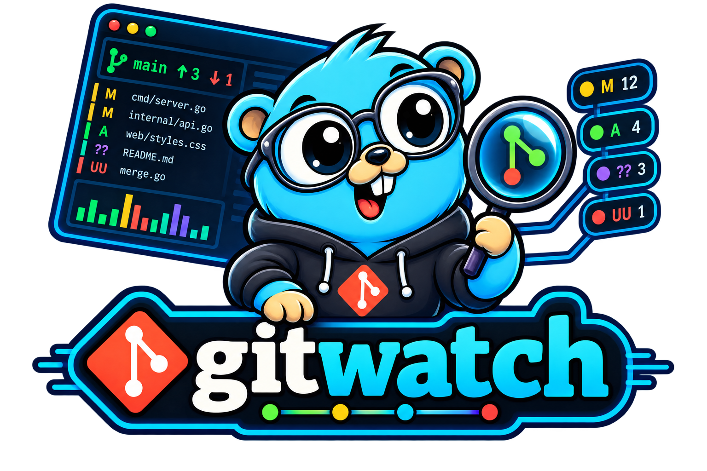

# gitwatch



An htop-style interactive Git worktree dashboard for the terminal. gitwatch continuously reflects authoritative Git status, shows staged/unstaged state and branch health, and lets you inspect diffs and safely stage or unstage paths without leaving the terminal.

## Install

Requires Go 1.25+ for source installation and Git on `PATH`.

```sh
go install github.com/jusanchez/gitwatch/cmd/gitwatch@latest
gitwatch --help
```

Release archives and SHA256SUMS are produced by `make release VERSION=1.0.0`. The development binary reports `1.0.0-dev`; release binaries report their tagged version with `gitwatch --version`.

## Quick start

Run `gitwatch` inside any normal Git worktree, including a nested directory. Select a status row with arrows or `j`/`k`; click a row to open its diff/details pane on the right in wide terminals. Press `Enter` or `d` for the keyboard equivalent, Space to stage/unstage, `b` for branches, `s` for stashes, `l` for history, `n` for remotes, `f` to fetch the selected remote, `m`/`e`/`o` to pull with merge/rebase/ff-only, `p` to push the current branch, `c` for the commit workspace, and `q` to quit. In the commit workspace, Tab switches subject/body and Ctrl-S executes a valid commit.

Force pushes are never implicit: in the Remotes workspace, `P` opens a confirmation naming the remote and branch, and `y` is required to run `--force-with-lease`.

In the History workspace, press `Enter` to inspect the selected commit, `/` to search by subject, author, or SHA, and `]` to load the next bounded page of commits.

Press `x` in History to request detached checkout of the selected commit; the exact SHA is shown and `y` is required to confirm.

Press `B` in History to enter a branch name for the selected commit; Enter executes the typed branch creation and Esc cancels.

Press `R` in History to start a revert; the exact selected SHA must be typed before Enter can execute it.

In Stashes, `C` creates a stash from an entered message; `u` toggles include-untracked (enabled by default); `a`, `p`, and `D` apply, pop, or drop the selected stash with confirmation where needed. Press `w` to inspect linked worktrees and their lock/prunable state; `A` adds one, `D` removes the selected one, and `P` prunes stale metadata after confirmation.

Press `t` in History to load tag names and object IDs from the repository.

Branches show the linked worktree path for locally checked-out branches.

Leaving the History workspace cancels its in-flight page load.

In the History inspector, `M` switches to the next merge parent, `f` filters the patch by path, `g` jumps to a typed ref, and `y` copies the selected SHA through terminal OSC52 clipboard support when available.

Remote conflict and non-fast-forward failures identify the operation and direct you to resolve conflicts before refreshing.

Press `Ctrl-P` from any workspace to search and run available commands; disabled commands explain why they cannot run.

Use `gitwatch --group work` to launch the repository dashboard filtered to a configured repository group.

Completed and failed core operations surface as bounded notices; failures remain dismissible through the notification model.

Press `v` to open the bounded multi-repository dashboard; rows show branch, dirty counts, divergence, and inactive/error state.

## Keymap and status symbols

See [KEYMAP.md](KEYMAP.md) for the complete default keymap. `S` means staged, `M` modified, `?` untracked, `!` conflict, `D` deleted, and `R` renamed. Symbols remain meaningful with `NO_COLOR=1`.

Advanced workflow notes are in [docs/advanced-workflows.md](docs/advanced-workflows.md), including history, patch, remote, GitHub, plugin, and multi-repository safety semantics.

See [docs/migration-v1.md](docs/migration-v1.md) for configuration and keymap migration and [docs/troubleshooting.md](docs/troubleshooting.md) for watch, provider, plugin, and release diagnostics.

## Configuration and watch modes

Configuration is JSON at `$XDG_CONFIG_HOME/gitwatch/config.json` or the platform fallback. `GITWATCH_CONFIG`, `GITWATCH_THEME`, `GITWATCH_MOTION`, `GITWATCH_WATCH`, and `GITWATCH_INTERVAL` provide explicit environment overrides; CLI flags take precedence. Watch modes are `auto`, `fs`, and `poll`. Motion is `full`, `reduced`, or `off`.

See [docs/configuration.md](docs/configuration.md) for the v2 schema, migration behavior, and keymap validation.

## Safety

Git is invoked through argv arrays, never shell strings. Paths are passed after `--` where supported. Staging and unstaging are reversible and refresh from Git afterward. Restore requires a confirmation naming the exact path and affected content; generic `reset --hard` and `clean -fd` actions are not available.

## Troubleshooting and architecture

Gitwatch requires an external Git executable and rejects bare repositories in v1. If filesystem notifications fail, `--watch=poll` or the configured poll mode keeps status current. See [ARCHITECTURE.md](ARCHITECTURE.md), [docs/performance.md](docs/performance.md), and [docs/edge-cases.md](docs/edge-cases.md) for design and validation details.

## Development

See [CONTRIBUTING.md](CONTRIBUTING.md). Security reports belong in [SECURITY.md](SECURITY.md).

## Demo recording

Run `./scripts/demo-repo.sh /tmp/gitwatch-demo` and follow [docs/demo.md](docs/demo.md) for a deterministic mixed-status recording fixture.

## Product
`gitwatch` is an htop-style interactive Git worktree dashboard for the terminal. It continuously reflects repository state, makes Git status understandable at a glance, and lets the user perform safe day-to-day Git actions directly from a rich TUI.

The v1 experience must feel alive: responsive keyboard and mouse interaction, tasteful animation, clear state transitions, immediate feedback, dense information without visual clutter, and safe Git operations.

## Locked stack
- Language: Go 1.25+
- TUI: `charm.land/bubbletea/v2`
- Components: `charm.land/bubbles/v2`
- Styling/layout: `charm.land/lipgloss/v2`
- Filesystem notifications: `github.com/fsnotify/fsnotify`
- Git integration: invoke the system `git` executable; do not implement Git object/index semantics in Go for v1.
- Parsing contract: prefer stable machine-readable Git output such as `git status --porcelain=v2 -z --branch`.
- Distribution: standalone static-ish binaries where platform permits; Git itself remains an external runtime requirement.
- Platforms at v1: macOS, Linux, Windows.
- License: MIT unless repository owner explicitly selects another license before Task 01.

## Non-negotiable UX
The default screen should resemble a polished process monitor rather than a simple list wrapper. It must expose branch/upstream state, divergence, counts, file states, staged/unstaged split, repository health/activity, selection details, context-sensitive actions, operation feedback, and a compact event timeline.

Users must be able to select a file and stage/unstage it without leaving the app. Mouse support is required, but every action must have a keyboard equivalent.

## Safety model
Never execute destructive Git actions silently. Staging/unstaging are immediate and reversible. Discard/reset/clean/restore/delete operations require an explicit confirmation UI that identifies exactly what will change. Shell interpolation of filenames is forbidden; commands must use argument arrays and `--` where applicable.

## Definition of v1
v1 is launchable only when all P0 tasks are complete, acceptance criteria pass on macOS/Linux/Windows, release artifacts are reproducible, README docs are complete, and the application has no known data-loss bug.

## Task order
Tasks are numbered in intended implementation order. A later task may be started early only when it does not change interfaces owned by an unfinished prerequisite. Record dependency exceptions in `DECISIONS.md`.
