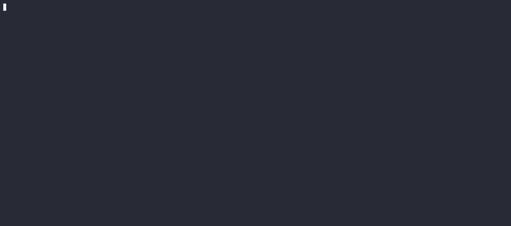
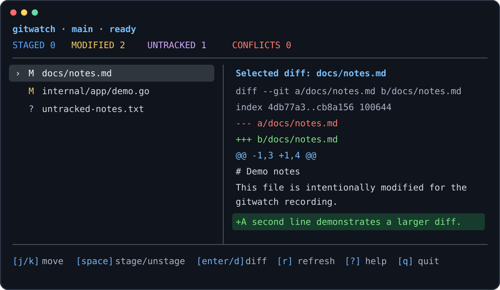

# gitwatch


An htop-style interactive Git worktree dashboard for the terminal. gitwatch continuously reflects authoritative Git status, shows staged and unstaged state and branch health, and lets you inspect diffs and perform guarded day-to-day Git operations without leaving the terminal.

> [!NOTE]
>
> 🤖 Agentically Built
>
> gitwatch is a completely agentically coded project.
>
> The project was designed and developed using OpenAI models throughout the planning, design, and implementation process:
>
> * ChatGPT — GPT-5.6 Sol was used to define the project, make architectural and technical decisions, write the implementation task specifications, plan the feature roadmap, and create the project logo.
> * Codex — GPT-5.6 Sol was used to implement the codebase by working through those task specifications.
>
> Human direction, review, testing, and project ownership remain part of the development process, but the planning and implementation itself was produced agentically from the task-driven specifications.
>
> This disclosure is included for transparency and to make the project’s development methodology explicit.



[Replay the complete terminal recording](docs/demo.cast), including live
refresh, mouse and keyboard diff opening, filtering, stage/unstage, and the
narrow-terminal overlay. See the [recording guide](docs/demo.md) for capture
provenance and local playback instructions.

## Features

- Live, authoritative porcelain-v2 status with filesystem watching and polling fallback.
- Responsive status dashboard with branch divergence, staged/unstaged state, conflicts, filtering, sorting, activity, and selected-file details.
- Flat and collapsible tree status presentation over the same authoritative file snapshot; `O` toggles modes and `[`/`]` collapse or expand directories.
- Long file paths and diff/details lines wrap to the active panel width instead of being silently truncated.
- Read-only staged/unstaged diff switching, bounded scrolling/search, and explicit large-diff truncation notices.
- Optional bottom-pane commit graph with bounded history (`--with-commit-tree` or `show_commit_tree`).
- Lower-left context panes for the commit tree, unpushed commits, and a read-only branch summary.
- Mouse or keyboard file selection that opens the selected file's diff without mutating the repository.
- Guarded stage, unstage, restore, hunk, commit, stash, branch, worktree, remote, and history workflows.
- Bounded path history and blame inspection, plus guarded historical patch editing through a controlled rebase.
- Typed-argv editor, opener, and difftool handoffs, with shell-free custom commands and context-aware bindings.
- Optional read-only GitHub pull-request/check visibility, multi-repository dashboards, and capability-bounded out-of-process plugins.
- Keyboard and mouse parity, `NO_COLOR`, semantic themes, high-contrast-safe text, and reduced/off motion.
- No telemetry.

### `.gitignore` manager

Press `I` from the status workspace to open the repository-scoped gitignore
catalog. The manager searches and multi-selects templates without changing the
worktree until you review and confirm a preview with `y` (cancel with `n` or
`Esc`). It can create a missing `.gitignore`, append a template, adopt an
existing matching template into a managed block, update an owned block, or
remove only content that gitwatch can prove it owns.

The catalog uses these indicators: `*` means the complete template matches,
`~` means a partial match, `+` means selected for an operation, `-` means an
owned/full match selected for removal, and `!` means an edited or invalid
managed block. A `*` is not an ownership claim: manually pasted rules remain
user-owned and are not automatically removed.

Templates are bundled from the pinned `github/gitignore` catalog snapshot and
remain available offline. The bundled commit is shown in the manager; an
optional `r` refresh downloads a commit-pinned snapshot, while `b` returns to
the bundled catalog. The upstream assets are distributed under CC0 1.0.
Changes are written atomically only after a preview and a before-content hash
check. External edits invalidate an open preview. Status remains the normal
authoritative Git porcelain refresh, including in the multi-repository view.
The release gate still requires native acceptance on macOS, Linux, and Windows;
see the [release checklist](docs/release-checklist.md).


### Colorized static view

The animated demo above shows the terminal interaction over time. This static
rendering makes the dashboard's color treatment and selected-file diff pane
easy to inspect at a glance:



## Install

gitwatch requires Git 2.23 or newer on `PATH`. Source installation and contributor checks are validated with Go 1.25.10 (the module language-version floor is Go 1.25.0):

```sh
go install github.com/sphireinc/git-watch/cmd/gitwatch@latest
gitwatch --help
```

Release archives for macOS, Linux, and Windows are published with `SHA256SUMS`. Verify the checksum, place the extracted `gitwatch` binary on `PATH`, and run `gitwatch --version`.

See [distribution and upgrade guidance](docs/distribution.md) for archive
verification, source installation, rollback, and configuration preservation.

To build the current checkout:

```sh
go build ./cmd/gitwatch
./gitwatch --version
```

Development builds report `1.0.0-dev`; tagged release builds embed the release version, commit, and build date.

## Quick start

Run `gitwatch` from a Git worktree or any nested directory:

```sh
cd path/to/repository
gitwatch
```

Use arrows or `j`/`k` to move, click a file row or press `Enter`/`d` to inspect its diff, and press Space to stage or unstage the selected path. The main workspaces are:

| Key | Workspace |
| --- | --- |
| `1` | Status |
| `c` | Commit |
| `s` | Stashes |
| `b` | Branches |
| `l` | History |
| `n` | Remotes |
| `G` | GitHub, when enabled |
| `E` | Plugins, when enabled |
| `w` | Worktrees |
| `v` | Repositories |
| `Ctrl-P` | Command palette |
| `?` | Context-sensitive help |
| `q` | Quit when no modal is open |

See [KEYMAP.md](KEYMAP.md) for the complete keymap and [docs/advanced-workflows.md](docs/advanced-workflows.md) for workflow-specific safety semantics.

From Status, press `h` with a selected path (including while its diff is open)
to load bounded path history without discarding the live Status selection. In a
path-history view, `f` explicitly toggles rename-following history, `]` loads
the next bounded page, `Enter` opens the selected commit’s path inspector, and
`Y` compares that commit with `HEAD`; `Esc` returns to the prior workspace.

From Status, an inspected path, or path history, press `L` to open bounded
blame pages. Select a line with `j`/`k` or the mouse and press `Enter` to open
its origin commit and parent-relative path diff.

In a history commit inspector, press `H` to select lines or hunks for a
guarded historical edit. Press `Enter` to preview the inverse patch and the
controlled rebase, which pauses at the selected commit and opens the amend
composer. `Ctrl-X` aborts the rebase and restores the original history; later
commits may replay with conflicts, and rewriting published history requires
coordination.

## Safety model

Git commands are executed with argument vectors, never shell command strings. Machine-readable and NUL-delimited Git formats are used where available, and repository-controlled text is sanitized before terminal rendering.

Staging and unstaging are reversible and always followed by an authoritative refresh. Restore, discard, branch deletion, worktree removal, force-with-lease, and other data-loss or history-changing actions require explicit confirmation identifying the affected path or ref. gitwatch does not expose generic `reset --hard`, raw `--force`, or `clean -fd` shortcuts.

Read the [security policy](SECURITY.md) and [threat model](docs/security.md) before reporting sensitive issues or enabling third-party plugins.

## Configuration

Configuration is JSON at `$XDG_CONFIG_HOME/gitwatch/config.json` or the platform configuration fallback. `GITWATCH_CONFIG`, `GITWATCH_THEME`, `GITWATCH_MOTION`, `GITWATCH_WATCH`, and `GITWATCH_INTERVAL` provide explicit environment overrides; CLI flags take precedence. The `layout.files_percent` and `layout.details_percent` settings control the wide status panel split and must sum to `100`.

```sh
gitwatch --config-check --config /path/to/config.json
gitwatch --config-inspect
```

See [docs/configuration.md](docs/configuration.md) and the [configuration schema](docs/configuration.schema.json). The configuration schema version is independent of the gitwatch release version.

The optional commit tree is disabled by default at startup. Enable it with
`gitwatch --with-commit-tree` or `"show_commit_tree": true`; it shows the most
recent 100 commits by default and can be bounded with `commit_tree.max_commits`.
Press `T` to open it on demand for the current session.

From the Status workspace, `T` opens the commit tree, `P` opens commits ahead of
the configured upstream, and `B` opens the read-only branch summary. These are
built-in shortcuts and can be overridden through the safe keymap configuration;
`b` continues to open the full branch-management workspace.

While the commit tree is focused, press Enter or click a commit to inspect its
changed files and view a historical per-file diff. Press `Esc` or `1` to return
to the current worktree status; inspection never checks out or mutates a
commit.

## Documentation

- [Documentation index](docs/README.md)
- [Architecture](ARCHITECTURE.md)
- [Default keymap](KEYMAP.md)
- [Advanced workflows](docs/advanced-workflows.md)
- [Configuration](docs/configuration.md)
- [`.gitignore` manager](docs/gitignore-manager.md)
- [Status context panes](docs/context-panes.md)
- [Plugin contract](docs/plugins.md) and [SDK](docs/plugin-sdk.md)
- [Performance](docs/performance.md) and [edge cases](docs/edge-cases.md)
- [Troubleshooting](docs/troubleshooting.md)
- [Release checklist](docs/release-checklist.md)
- [Roadmap](ROADMAP.md)

## Development

Read [CONTRIBUTING.md](CONTRIBUTING.md) before opening a pull request. The standard local gate is:

```sh
make check
```

Use `./scripts/demo-repo.sh /tmp/gitwatch-demo` and [docs/demo.md](docs/demo.md) for a deterministic mixed-status demo repository.

## License

gitwatch is available under the [MIT License](LICENSE). Third-party dependency notices are listed in [THIRD_PARTY_NOTICES.md](THIRD_PARTY_NOTICES.md).
